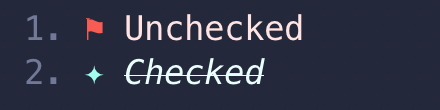
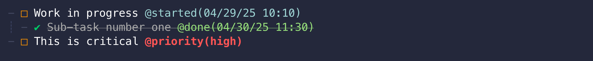
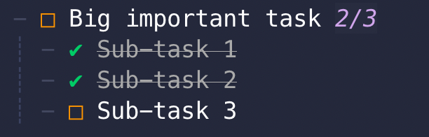
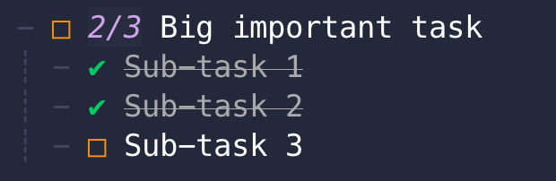
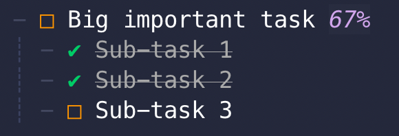
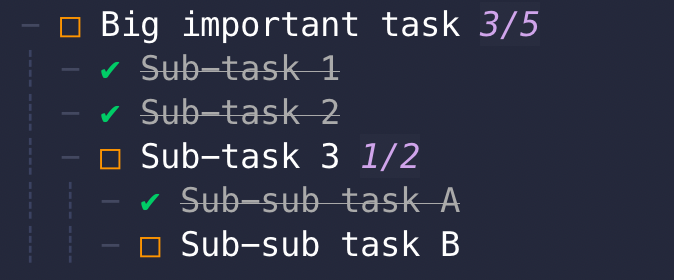

<div align="center">

# checkmate.nvim

### A simple Todo plugin

[](http://www.lua.org)
[](https://neovim.io)


</div><br/>

A Markdown-based todo list plugin for Neovim with a nice UI and full customization options.

### Features
- Stores todos in plain Markdown format (compatible with other apps)
- Unicode symbol support for more beautiful todo items
- Customizable markers and colors
- Visual mode support for toggling multiple items at once
- Metadata e.g. `@tag(value)` annotations with extensive customization
  - e.g. @started, @done, @priority, @your-custom-tag
- Todo completion counts

<br/>
<div style="display: flex; justify-content: space-evenly">


</div>
<br/>

https://github.com/user-attachments/assets/a8c018ac-69a4-4bf7-8ea3-ecbdf4dda661

# ☑️ Installation

## Requirements

- Neovim 0.10 or higher

### Using [lazy.nvim](https://github.com/folke/lazy.nvim)

```lua
{
    "bngarren/checkmate.nvim",
    opts = {
        -- your configuration here
        -- or leave empty to use defaults
    },

}
```

# ☑️ Usage

#### 1. Open or Create a Todo File

- Create or open a file with the `.todo` extension
- The plugin automatically activates for `.todo` files, treating them as Markdown

> As of now, the plugin is only activated when a buffer with `.todo` extension is opened.

#### 2. Create Todo Items

- Use the **mapped key** (_recommended_, default: `<leader>Tn`) or the `:CheckmateCreate` command
- Or manually using Markdown syntax:

```md
- [ ] Unchecked todo
- [x] Checked todo
```

(These will automatically convert when you leave insert mode!)

#### 3. Manage Your Tasks

- Toggle items with `:CheckmateToggle` (default: `<leader>Tt`)
- Check items with `:CheckmateCheck` (default: `<leader>Tc`)
- Uncheck items with `:CheckmateUncheck` (default: `<leader>Tu`)
- Select multiple items in visual mode and use the same commands

Enhance your todos with custom [metadata](#metadata) with quick keymaps!

> Your .todo file is saved as regular markdown ✔

# ☑️ Commands

:CheckmateToggle
: Toggle the todo item under the cursor (normal mode) or all todo items within the selection (visual mode)

:CheckmateCreate
: Convert the current line to a todo item

:CheckmateCheck
: Mark todo item as checked (done/completed)

:CheckmateUncheck
: Mark todo item as unchecked

# ☑️ Config

```lua
--- Checkmate configuration
---@class checkmate.Config
---@field enabled boolean Whether the plugin is enabled
---@field notify boolean Whether to show notifications
---@field log checkmate.LogSettings Logging settings
---Keymappings (false to disable)
---Note: mappings for metadata are set separately in the `metadata` table
---@field keys ( table<string, checkmate.Action>| false )
---@field todo_markers checkmate.TodoMarkers Characters for todo markers (checked and unchecked)
---@field default_list_marker "-" | "*" | "+" Default list item marker to be used when creating new Todo items
---@field style checkmate.StyleSettings Highlight settings
--- Depth within a todo item's hierachy from which actions (e.g. toggle) will act on the parent todo item
--- Examples:
--- 0 = toggle only triggered when cursor/selection includes same line as the todo item/marker
--- 1 = toggle triggered when cursor/selection includes any direct child of todo item
--- 2 = toggle triggered when cursor/selection includes any 2nd level children of todo item
---@field todo_action_depth integer
---@field enter_insert_after_new boolean Enter insert mode after `:CheckmateCreate`
---Enable/disable the todo count indicator (shows number of sub-todo items completed)
---@field show_todo_count boolean
---Position to show the todo count indicator (if enabled)
---eol = End of the todo item line
---inline = After the todo marker, before the todo item text
---@field todo_count_position checkmate.TodoCountPosition
---Formatter function for displaying the todo count indicator
---@field todo_count_formatter? fun(completed: integer, total: integer): string
---Whether to count sub-todo items recursively in the todo_count
---If true, all nested todo items will count towards the parent todo's count
---@field todo_count_recursive boolean
---Whether to register keymappings defined in each metadata definition. If set the false,
---metadata actions (insert/remove) would need to be called programatically or otherwise mapped manually
---@field use_metadata_keymaps boolean
---Custom @tag(value) fields that can be toggled on todo items
---@field metadata checkmate.Metadata

---Actions that can be used for keymaps in the `keys` table of 'checkmate.Config'
---@alias checkmate.Action "toggle" | "check" | "uncheck" | "create" | "remove_all_metadata"

---Options for todo count indicator position
---@alias checkmate.TodoCountPosition "eol" | "inline"

-----------------------------------------------------
---@class checkmate.LogSettings
--- Any messages above this level will be logged
---@field level ("trace" | "debug" | "info" | "warn" | "error" | "fatal" | vim.log.levels.DEBUG | vim.log.levels.ERROR | vim.log.levels.INFO | vim.log.levels.TRACE | vim.log.levels.WARN)?
--- Should print log output to a file
--- Open with `:Checkmate debug_file`
---@field use_file boolean
--- The default path on-disk where log files will be written to.
--- Defaults to `~/.local/share/nvim/checkmate/current.log` (Unix) or `C:\Users\USERNAME\AppData\Local\nvim-data\checkmate\current.log` (Windows)
---@field file_path string?
--- Should print log output to a scratch buffer
--- Open with `require("checkmate").debug_log()`
---@field use_buffer boolean

-----------------------------------------------------
---@class checkmate.TodoMarkers
---@field unchecked string Character used for unchecked items
---@field checked string Character used for checked items

-----------------------------------------------------
---@class checkmate.StyleSettings Customize the style of markers and content
---@field list_marker_unordered vim.api.keyset.highlight Highlight settings for unordered list markers (-,+,*)
---@field list_marker_ordered vim.api.keyset.highlight Highlight settings for ordered (numerical) list markers (1.,2.)
---@field unchecked_marker vim.api.keyset.highlight Highlight settings for unchecked markers
---Highlight settings for main content of unchecked todo items
---This is typically the first line/paragraph
---@field unchecked_main_content vim.api.keyset.highlight
---Highlight settings for additional content of unchecked todo items
---This is the content below the first line/paragraph
---@field unchecked_additional_content vim.api.keyset.highlight
---@field checked_marker vim.api.keyset.highlight Highlight settings for checked markers
---Highlight settings for main content of checked todo items
---This is typically the first line/paragraph
---@field checked_main_content vim.api.keyset.highlight
---Highlight settings for additional content of checked todo items
---This is the content below the first line/paragraph
---@field checked_additional_content vim.api.keyset.highlight
---Highlight settings for the todo count indicator (e.g. x/x)
---@field todo_count_indicator vim.api.keyset.highlight

-----------------------------------------------------
---@class checkmate.MetadataProps
---Additional string values that can be used interchangably with the canonical tag name.
---E.g. @started could have aliases of `{"initiated", "began"}` so that @initiated and @began could
---also be used and have the same styling/functionality
---@field aliases string[]?
---Highlight settings or function that returns highlight settings based on the metadata's current value
---@field style vim.api.keyset.highlight|fun(value:string):vim.api.keyset.highlight
---Function that returns the default value for this metadata tag
---@field get_value fun():string
---Keymapping for toggling this metadata tag
---@field key string?
---Used for displaying metadata in a consistent order
---@field sort_order integer?
---Moves the cursor to the metadata after it is inserted
---  - "tag" - moves to the beginning of the tag
---  - "value" - moves to the beginning of the value
---  - false - disables jump (default)
---@field jump_to_on_insert "tag" | "value" | false?
---Selects metadata text in visual mode after metadata is inserted
---The `jump_to_on_insert` field must be set (not false)
---The selected text will be the tag or value, based on jump_to_on_insert setting
---Default (false) - off
---@field select_on_insert boolean?

---Callback to run when this metadata tag is added to a todo item
---E.g. can be used to change the todo item state
---@field on_add fun(todo_item: checkmate.TodoItem)?
---Callback to run when this metadata tag is removed from a todo item
---E.g. can be used to change the todo item state
---@field on_remove fun(todo_item: checkmate.TodoItem)?

---A table of canonical metadata tag names and associated properties that define the look and function of the tag
---@alias checkmate.Metadata table<string, checkmate.MetadataProps>

-----------------------------------------------------
---@type checkmate.Config
local _DEFAULTS = {
  enabled = true,
  notify = true,
  -- Default keymappings
  keys = {
    ["<leader>Tt"] = "toggle", -- Toggle todo item
    ["<leader>Tc"] = "check", -- Set todo item as checked (done)
    ["<leader>Tu"] = "uncheck", -- Set todo item as unchecked (not done)
    ["<leader>Tn"] = "create", -- Create todo item
    ["<leader>TR"] = "remove_all_metadata", -- Remove all metadata from a todo item
  },
  default_list_marker = "-",
  todo_markers = {
    unchecked = "□",
    checked = "✔",
  },
  style = {
    -- List markers, such as "-" and "1."
    list_marker_unordered = {
      -- Can use util functions to get existing highlight colors and blend them together
      -- This is one way to integrate with an existing colorscheme
      fg = util.blend(util.get_hl_color("Normal", "fg", "#bbbbbb"), util.get_hl_color("Normal", "bg", "#222222"), 0.2),
    },
    list_marker_ordered = {
      fg = util.blend(util.get_hl_color("Normal", "fg", "#bbbbbb"), util.get_hl_color("Normal", "bg", "#222222"), 0.5),
    },

    -- Unchecked todo items
    unchecked_marker = { fg = "#ff9500", bold = true }, -- The marker itself
    unchecked_main_content = { fg = "#ffffff" }, -- Style settings for main content: typically the first line/paragraph
    unchecked_additional_content = { fg = "#dddddd" }, -- Settings for additional content

    -- Checked todo items
    checked_marker = { fg = "#00cc66", bold = true }, -- The marker itself
    checked_main_content = { fg = "#aaaaaa", strikethrough = true }, -- Style settings for main content: typically the first line/paragraph
    checked_additional_content = { fg = "#aaaaaa" }, -- Settings for additional content

    -- Todo count indicator
    todo_count_indicator = {
      fg = util.blend("#e3b3ff", util.get_hl_color("Normal", "bg", "'#222222"), 0.9),
      bg = util.blend("#ffffff", util.get_hl_color("Normal", "bg", "'#222222"), 0.02),
      italic = true,
    },
  },
  todo_action_depth = 1, --  Depth within a todo item's hierachy from which actions (e.g. toggle) will act on the parent todo item
  enter_insert_after_new = true, -- Should enter INSERT mode after :CheckmateCreate (new todo)
  show_todo_count = true,
  todo_count_position = "eol",
  todo_count_recursive = true,
  use_metadata_keymaps = true,
  metadata = {
    -- Example: A @priority tag that has dynamic color based on the priority value
    priority = {
      style = function(_value)
        local value = _value:lower()
        if value == "high" then
          return { fg = "#ff5555", bold = true }
        elseif value == "medium" then
          return { fg = "#ffb86c" }
        elseif value == "low" then
          return { fg = "#8be9fd" }
        else -- fallback
          return { fg = "#8be9fd" }
        end
      end,
      get_value = function()
        return "medium" -- Default priority
      end,
      key = "<leader>Tp",
      sort_order = 10,
      jump_to_on_insert = "value",
      select_on_insert = true
    },
    -- Example: A @started tag that uses a default date/time string when added
    started = {
      aliases = { "init" },
      style = { fg = "#9fd6d5" },
      get_value = function()
        return tostring(os.date("%m/%d/%y %H:%M"))
      end,
      key = "<leader>Ts",
      sort_order = 20,
    },
    -- Example: A @done tag that also sets the todo item state when it is added and removed
    done = {
      aliases = { "completed", "finished" },
      style = { fg = "#96de7a" },
      get_value = function()
        return tostring(os.date("%m/%d/%y %H:%M"))
      end,
      key = "<leader>Td",
      on_add = function(todo_item)
        require("checkmate").set_todo_item(todo_item, "checked")
      end,
      on_remove = function(todo_item)
        require("checkmate").set_todo_item(todo_item, "unchecked")
      end,
      sort_order = 30,
    },
  },
  log = {
    level = "info",
    use_file = false,
    use_buffer = false,
  },
}
```

Note: `checkmate.StyleSettings` uses highlight definition maps to define the colors/style, refer to `:h nvim_set_hl()`

## Metadata

Metadata tags allow you to add custom `@tag(value)` annotations to todo items.

<br/>

- Default tags:
  - `@started` - default value is the current date/time
  - `@done` - default value is the current date/time
  - `@priority` - "low" | "medium" (default) | "high"

#### @priority example

```lua
priority = {
  -- Dynamic styling based on the tag's current value
  style = function(value)
    local value = value:lower()
    if value == "high" then
      return { fg = "#ff5555", bold = true }
    elseif value == "medium" then
      return { fg = "#ffb86c" }
    elseif value == "low" then
      return { fg = "#8be9fd" }
    else -- fallback
      return { fg = "#8be9fd" }
    end
  end,
  get_value = function() return "medium" end,  -- Default value
  key = "<leader>Tp",                          -- Keymap to toggle
  sort_order = 10,                             -- Order when multiple tags exist (lower comes first)
  jump_to_on_insert = "value",                 -- Move the cursor after insertion
  select_on_insert = true                      -- Select the 'value' (visual mode) on insert
},
```

#### @done example

```lua
done = {
  aliases = { "completed", "finished" },
  style = { fg = "#96de7a" },
  get_value = function()
    return tostring(os.date("%m/%d/%y %H:%M"))
  end,
  key = "<leader>Td",
  -- Changes todo state when tag is added
  on_add = function(todo_item)
    require("checkmate").set_todo_item(todo_item, "checked")
  end,
  -- Changes todo state when tag is removed
  on_remove = function(todo_item)
    require("checkmate").set_todo_item(todo_item, "unchecked")
  end,
  sort_order = 30,
},
```

## Todo count indicator

<table>
  <tr>
    <td align="center">
      <br/>
      <sub>Todo count indicator using <code>eol</code> position</sub>
    </td>
    <td align="center">
      <br/>
      <sub>Todo count indicator using <code>inline</code> position</sub>
    </td>
  </tr>
</table>

#### Change the default display by passing a custom formatter

```lua
-- Custom formatter that returns the % completed
todo_count_formatter = function(completed, total)
  return string.format("%.0f%%", completed / total * 100)
end,
```

<br/>
<sub>Todo count indicator using <code>todo_count_formatter</code> function</sub>

#### Count all nested todo items
If you want the todo count of a parent todo item to include _all_ nested todo items, set the recursive option.

```lua
todo_count_recursive = true,
```
<br/>
<sub>Todo count indicator using <code>recursive</code> option. The children of 'Sub-task 3' are included in the overall count of 'Big important task'.</sub> 

# Roadmap

Planned features:

- [x] **Metadata support** - mappings for quick addition of metadata/tags such as @start, @done, @due, @priority, etc. with custom highlighting. _Added v0.2.0_

- [ ] **Archiving** - manually or automatically move completed items to the bottom of the document

- [x] **Sub-task counter** - add a completed/total count (e.g. 1/4) to parent todo items. _Added v0.3.0_

# Contributing

If you have feature suggestions or ideas, please feel free to open an issue on GitHub!

# Credits

- Inspired by the [Todo+](https://github.com/fabiospampinato/vscode-todo-plus) VS Code extension (credit to @[fabiospampinato](https://github.com/fabiospampinato))
